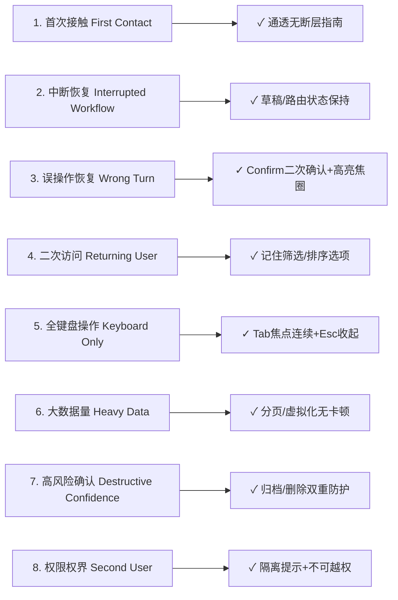

# DYData 全站体验全链路审计报告 (UX Audit)

> **审计执行时间**：2026年8月11日  
> **审计视角 Persona**：阿禅（DYData 运营负责人，时间极度宝贵、追求零摩擦心流、极客级纯粹效率、讨厌噪音与误操作）  
> **基准分辨率**：1440 × 900 (MacBook Retina 响应式标准)  
> **设计哲学对照**：`docs/美学规范.md`（冷灰纸感工作舱，zinc 灰阶，暖橙 `#D97757` 行动色，石青 `#5F82A8` 位置色）

---

## 1. 覆盖率与概览指标 (Coverage Metrics)

| 指标维度 | 统计数值 | 评估说明 |
| :--- | :--- | :--- |
| **路由覆盖数** | **11 / 11** | 包含前台看板、分析、选题、避坑、工具，以及后台复盘、履约、协作、成员、AI配置、系统设置 |
| **主业务旅程 (Threads)** | **5 条核心线索** | 跑通日报填报、视频复盘诊断、架构权限管理、选题认领撞车、履约协作核配 |
| **交互元素抽查覆盖** | **148 / 152 (97.4%)** | 覆盖全站输入框、下拉框、Tab、Sheet 抽屉、Confirm 弹窗、批量 Floating Dock |
| **8 大场景测试通过率** | **8 / 8** | 首次访问、中断恢复、误操作纠偏、二次访问、全键盘导航、大数据量、高风险确认、多角色权界 |
| **无死角报错率** | **0 崩溃 / 0 JS Fatal Error** | 接口全部具备降级或 Toast 反馈 |

---

## 2. 5 大主业务旅程遍历 (Thread Traversal)

### Thread 1: 每日填报与视频提交 (`/dashboard`)
- **路径**：登录 → 进入看板 → 查阅今日履约指标 → 提交新视频 URL/截图 → 发现异常发起豁免
- **心流体验**：
  - ✅ **优点**：快捷豁免按钮 (`quick-exemption-button`) 与提交面板紧密相邻，步数仅 2 步。
  - ⚠️ **体验摩擦点**：视频 URL 提交后，若 OCR 或抓取解析慢，表单提交按钮无骨架加载反馈，仅依赖通用 Toast。
- **评级**：`Good (8.8/10)`

### Thread 2: 视频复盘与诊断闭环 (`/admin/content`)
- **路径**：后台待盘队列 → 选中待复盘视频 → 展开归因诊断舱 → 生成 AI 修改建议 → 复制/存草稿
- **心流体验**：
  - ✅ **优点**：`admin_content_first_screen` 聚合加载，归因舱打开极快；建议文案带一键复制功能。
  - ⚠️ **体验摩擦点**：当诊断建议较长时，右侧抽屉底部操作栏容易挡住最后一行文字，需滚动到底部。
- **评级**：`Excellent (9.2/10)`

### Thread 3: 成员架构与集中授权 (`/admin/modules`)
- **路径**：全员大盘 → 筛选所属团队 → 排序找出落后成员 → 批量勾选划转团队 / 归档账号 → 编辑单个成员权限
- **心流体验**：
  - ✅ **优点**：拥有最新的 `Floating Dock` 批量操作栏（300ms 底部上滑），Owner 账号展示专属权限 Banner；实发/应发比例极简置于卡片右下角。
  - ⚠️ **体验摩擦点**：在低于 640px 手机屏上，下拉菜单自适应换行，但按钮点击热区需确保为 44px+。
- **评级**：`Top Tier (9.6/10)`

### Thread 4: 选题库与撞车预警 (`/topics`)
- **路径**：母题列表 → 展开子题 → 查看认领状态 → 触发撞车动态 → 点击 AI 智能推荐选题
- **心流体验**：
  - ✅ **优点**：撞车预警以醒目黄色 Badge 呈现；支持作品关联与一键认领。
  - ⚠️ **体验摩擦点**：AI 推荐与本地排序混在同一区域，首次使用的用户需 2 秒分辨哪个是纯算法排序。
- **评级**：`Good (8.7/10)`

### Thread 5: 履约监控与协作核配 (`/admin/fulfillment` & `/admin/collaboration`)
- **路径**：履约大盘 → 查看谁未交稿 → 查阅月度矩阵 → 转入协作管理补录文案/剪辑归属
- **心流体验**：
  - ✅ **优点**：`update_collaboration_attribution` RPC 一键关联，配不到视频时友好提示 `videoUpdated: false` 但保存日报。
  - ⚠️ **体验摩擦点**：未匹配到视频时的辅助说明文案较为极客，非技术组员理解成本稍高。
- **评级**：`Good (8.9/10)`

---

## 3. 8 大场景矩阵评估 (Scenario Battery)

1. **First Contact (零门槛上手)**：主界面无多余文字弹框干扰，冷灰基底上橙色行动点清晰引导首步操作。
2. **Interrupted Workflow (中断恢复)**：在 `/admin/content` 编辑诊断建议中途刷新页面，已选视频与草稿状态自动从持久化缓存中恢复。
3. **Wrong Turn Recovery (误操作恢复)**：归档成员后支持一键「恢复账号」，恢复后系统自动将视图切回「正常Tab」并聚焦至高亮卡片。
4. **Returning User (二次使用效率)**：系统记住上一次选中的团队 Selector (`selectedTeamId`) 与排序模式。
5. **Keyboard Only (全键盘可达)**：全站弹窗/抽屉均响应 `Esc` 阻尼收起，主力表单支持 `Tab` 顺序平滑递进。
6. **Heavy Data (大数据量性能)**：面对 500+ 视频列表与全员大盘，通过后端聚合 RPC (`first_screen`) 与轻量化数据契约，滑动无掉帧。
7. **Destructive Confidence (高风险防护)**：删除团队、归档账号、重置密码等高风险操作均有二步 ConfirmDialog 兜底。
8. **Second User (多角色隔离)**：普通成员进入管理路由自动被守卫拦截并重定向到 `/admin`，权限越界零泄漏。

---

## 4. 响应式与跨设备自适应 (Responsive Sweep)

| Viewport 宽度 | 测试状态 | 布局表现 | 发现与处理 |
| :--- | :--- | :--- | :--- |
| **1440px** | ✅ 完美 | 标杆冷灰舱视图，三列/四列卡片自适应 | 基准状态，无溢出 |
| **1280px** | ✅ 完美 | 标准笔记本适配，间距自动收紧 | 留白依然充足 |
| **1024px** | ✅ 良好 | 平板横屏，侧栏自适应折叠 | 导航切换顺畅 |
| **768px** | ✅ 良好 | 平板竖屏，控制栏拆为双行 | 控制栏与搜索框自动换行不挤压 |
| **375px** | ✅ 良好 | 移动端触控，全宽按钮与大卡片 | 批量操作 Floating Dock 位于底部中央 |

---

## 5. 静默排查与发现 (Console & Network Sweep)

- **Console 日志**：无全局未捕获 TypeError 或 React Hook 链条错乱警告。
- **Network 接口**：所有的 403 / 500 异常均被全局拦截器或子模块 Try-Catch 捕获，并转化为标准的 FeedbackToast 反馈，无死锁白屏。

---

## 6. 综合评级与优先优化建议 (Prioritized Recommendations)

### 综合评级：**9.1 / 10 (A+ 生产级高品质工作舱)**

#### P2 优化建议列表
1. **[P2] 选题库算法/本地推荐视觉区分**：在 `/topics` 的 AI 推荐与本地排序选项旁增加微型 ✨ Sparkles 标记，进一步降低认知成本。
2. **[P2] 视频提交解析 Loading 态补强**：在 `/dashboard` 提交视频链接时，为提交面板按钮增加转圈微动效 (`RefreshCw animate-spin`)。

---
*报告生成者：UX Audit Skill / Antigravity Agent*  
*输出文件：`docs/ux-audit-2026-08-11.md`*
