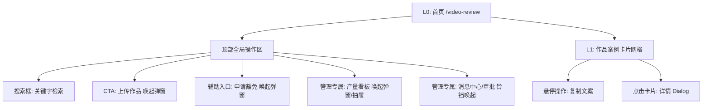

# 产量对账系统 — 交互与视觉设计方案 (UI/UX Spec)

> **设计心智**：U1 (提交 - 快速完成，不需思考) + U2 (查阅 - 快速扫描，通透无阻) + M1 (审核 - 行内决策，高效批量)
> **美学基准**：暖灰底色（L0: bg-stone-100） + 白色容器（L1: bg-white） + 唯一暖橙主 CTA（#D97757）
> **目标**：以单页 `/video-review` 为主容器，摒弃原有割裂路由，采用「卡片流网格 + 弹出式 Dialog」的轻量化工作台。

---

## 1. 用户画像与核心场景细化

### 👨‍💻 角色 A：普通组员 (对账提交端)
* **画像特征**：30 人短视频制作团队成员，日均发片 4-6 部。每天多次登录，处于高频、机械的重复操作中。
* **痛点场景**：
  * 旧版网页需要在不同路由下反复切换查看自己交了几个、别人发了什么，体验极具割裂感。
  * 害怕漏交导致扣考核，需要极其醒目的“今日目标达成度”指引。
* **改动目标**：3 秒内一键唤起提交，提交后 1s 自动乐观刷新，无感完成当日对账。

### 👩‍💼 角色 B：团队管理者 (看板与审核端)
* **画像特征**：运营总监、组长或 Owner。每天需对 30+ 成员的 150+ 视频进行逐个对账、处理请假审批。
* **痛点场景**：
  * 在堆积如山的卡片中很难一眼揪出“谁没交、谁请假了”。
  * 审批豁免需要一条条点击，缺乏“批量一键同意”等救命级效率工具。
* **改动目标**：引入全局状态红绿灯，提供看板抽屉与批量审批入口，实现“一秒扫视，一键通过”。

---

## 2. 交互流与信息架构

### 2.1 页面总体信息架构



### 2.2 异常与并发边界处理

* **离线/提交失败**：
  * 提交弹窗中，若接口抛出 500/网络错误，禁止关闭弹窗。
  * 按钮从 Loading 状态回滚为激活，右侧展示 inline 错误文本，同时弹出 `sonner` 红色异常 Toast。
* **空数据态 (Empty State)**：
  * 列表无数据时，展示 L1 级别的卡片型插画（退晕至 `stone-300` 墨水风插图） + 温润的引导文案“今日还没有作品提交，点击右上角成为第一个提交者” + 唯一的暖橙色上传按钮。
* **豁免申请并发冲突**：
  * 当管理者审批某条已被其他协作者处理 of 豁免申请时，接口返回“状态已更新”，弹窗行即时呈灰色退晕，并 Toast 提示“该申请已被他人处理”。

---

## 3. 界面布局与视觉细节设计

### 3.1 首页 `/video-review` 整体布局 (Layout Wireframe)

```
+-------------------------------------------------------------------------------------------------------------------+
|  [视频审核] / 产量对账                                             [⏰ (3)] [产量看板] [申请豁免] [上传作品]  |
+-------------------------------------------------------------------------------------------------------------------+
|  [ Q 搜索视频文案案例...                                                                                  ]   |
+-------------------------------------------------------------------------------------------------------------------+
|  +---------------------+  +---------------------+  +---------------------+  +---------------------+  +-------------+  |
|  | [截图 16:10]         |  | [截图 16:10]         |  | [截图 16:10]         |  | [截图 16:10]         |  |             |  |
|  |                     |  |                     |  |                     |  |                     |  |             |  |
|  |---------------------|  |---------------------|  |---------------------|  |---------------------|  |             |  |
|  | 甜辣风穿搭分享...    |  | 夏日清爽穿搭...      |  | 职场干练风...        |  | 复古港风...          |  |  (卡片流)   |  |
|  | [成员A]  [时间]      |  | [成员B]  [时间]      |  | [成员C]  [时间]      |  | [成员D]  [时间]      |  |             |  |
|  +---------------------+  +---------------------+  +---------------------+  +---------------------+  +-------------+  |
+-------------------------------------------------------------------------------------------------------------------+
```

*注：[⏰ (3)] 消息中心红点规范：铃铛图标右上角悬浮红色圆形徽章 `bg-rose-500 text-white`，数字居中，用于展示待审申请数量。*

### 3.2 提交作品弹窗 (`SubmitDialog` - 中等 `max-w-2xl`)

* **顶部指标看板**：
  * 采用 `bg-stone-50` 材质区，不加边框，通过 16px 留白和底色差将指标信息托起。
  * 极醒目显示：“今天要交 `4` 条，已交 `2` 条，还差 `2` 条”，其中数字使用 `text-[24px] font-mono text-stone-800`，缺额高亮为 `#D97757`（暖橙色）。
* **多图拖拽上传区**：
  * 边框采用 `border-dashed border-stone-300 bg-stone-50/50 hover:bg-stone-50 hover:border-stone-400`。
  * 拖拽图片进入时，带 150ms 缩放动效；预览图采用 12px 圆角小卡片，右上角提供微型悬浮删除按钮。
* **表单控件**：
  * 文本框输入时，使用底色差方案：输入框在白色弹窗内为 `bg-stone-100`，Focus 状态外框呈现 `ring-2 ring-stone-800/10 border-stone-800`。
  * 默认焦点自动聚焦于文案输入框首行。

### 3.3 产量看板弹窗 (`DashboardDialog` - 超大 `max-w-6xl` / 手机端全屏)

* **顶部汇总数据**：
  * 展现三枚通透无框的指标块，使用 `tabular-nums font-mono` 展示：
    1. 全队总目标度：`85 / 120` 件（墨水绿 `#6FAA7D` 代表进展良好）
    2. 豁免/请假人数：`3` 人（辅助色石青 `#8AA8C7`）
    3. 异常红灯人数：`2` 人（高亮矿物红 `#C9604D`）
* **层级化列表 (Accordion-Grid)**：
  * 团队按“小组”层级折叠展开。小组头部显示当前小组达成度（例如：`第一组: 90%`）。
  * 成员行点击可就地展开抽屉或二级 Dialog，展示该成员今日提交的所有截图缩略图（点击成员时，通过调用 `getUserSubmissions(userId, selectedDate)` 单独按需查询该用户的提交记录获取截图）。
  * **状态指示灯位置**：紧贴在成员头像的右下角或姓名右侧，状态语义唯一映射：
    * 🔴 红灯（未达标且无豁免）：`bg-[#C9604D] ring-2 ring-white w-2.5 h-2.5 rounded-full`（静态不闪烁，不产生视觉疲劳）。
    * 🟡 黄灯（请假豁免待审批）：`bg-[#D99E55] ring-2 ring-white w-2.5 h-2.5 rounded-full`。
    * 🟢 绿灯（已达标或已批豁免）：`bg-[#6FAA7D] ring-2 ring-white w-2.5 h-2.5 rounded-full`。

### 3.4 审批中心弹窗 (`ApprovalDialog` - 大尺寸 `max-w-4xl`)

* **批量操作区**：
  * 顶部有常驻批量选择复选框（Checkboxes），勾选多项后，右上角浮现主 CTA 按钮：“批量同意 (N)”，点击后伴随 300ms 滑动淡出效果，批量处理申请。
  * 每行申请单边 `border-b border-stone-200` 分隔，不形成闭合轮廓以防止“嵌套违规”。

---

## 4. 动效与微交互规范

| 场景 | 动效类型 | 持续时间 (Duration) | 缓动函数 (Easing) | 视觉表现 |
| :--- | :--- | :--- | :--- | :--- |
| **卡片悬停 (Hover)** | 缩放 + 浮起 | 150ms | `cubic-bezier(0.4, 0, 0.2, 1)` | `translate-y-[-4px] shadow-lg`，操作按钮淡入 |
| **弹窗唤起 (Open)** | 淡入 + 缩放 | 300ms | `cubic-bezier(0.16, 1, 0.3, 1)` | `fade-in-0 zoom-in-95` 从屏幕正中滑入 |
| **弹窗关闭 (Close)** | 淡出 + 缩放 | 200ms | `ease-in` | `fade-out-0 zoom-out-95` 迅速退回后台 |
| **提交成功 (Success)** | 乐观推入 + 自动淡出 | 500ms / 1s 延时 | `ease-out` | 新卡片从顶部滑入并推开下方卡片，弹窗延迟 1s 自动淡出关闭 |
| **数字更新 (Counter)** | 滚动翻页 (Roll) | 300ms | `cubic-bezier(0.34, 1.56, 0.64, 1)` | 顶部未读数或指标数滚动翻滚更新 |

---

## 5. 美学自检对照表 (Aesthetic Checklists)

1. **结构胜于线条**：去除了原版卡片内部的大量分割边框，通过 `space-y-6` (24px) 和 `bg-stone-50` 材质区实现高辨识度区分。
2. **唯一橙色 CTA**：全局只有“确认提交”、“批量同意”等最终动作使用暖橙色 `#D97757`，其余例如“取消”、“关闭”统一为 `bg-stone-200 text-stone-700` 或 `variant="ghost"`。
3. **色彩映射专一性**：全站无其他花哨彩色，红色仅表示异常（🔴 `#C9604D`）、黄色代表待处理（🟡 `#D99E55`）、绿色代表完成（🟢 `#6FAA7D`），石青（🔵 `#8AA8C7`）代表定位/当前。
4. **数字对齐性**：大中型数据（看板上的达成数、倒数条数）全部锁死 `font-mono tabular-nums`，无数字抖动。
5. **层级深度**：无论是大看板还是审批列表，物理嵌套级数一律控制在 1 层（无“盒子套盒子套盒子”现象）。

---

## 6. 面向 Codex 的前后端交接规范

在交互稿通过审核后，前端将与 Codex 后端以下列契约点进行数据对接：

1. **共享状态定义**：
   ```typescript
   export type QuotaStatus = 'EXCEEDED' | 'COMPLETED' | 'PENDING' | 'EXEMPTED' | 'VIOLATED';
   // 对应状态灯: COMPLETED/EXCEEDED -> 绿灯, PENDING -> 黄灯, VIOLATED -> 红灯, EXEMPTED -> 灰绿/静默
   ```
2. API 请求契约：
   * 作品提交接口：`POST /api/work-submissions`
   * 豁免申请接口：`POST /api/exemptions/apply`
   * 成员截图获取：点击成员行时，调用 `getUserSubmissions(targetUserId, date)`（等效于 `GET /api/work-submissions?user_id=xxx&date=xxx`），按需查询截图数组。
3. 批量审批前端并发逻辑：
   * 接口：后端仅支持单条审批 `POST /api/exemptions/review`。
   * 实现方式：前端通过 `Promise.all` 并发调用单条审批接口，实现批量同意/拒绝。
