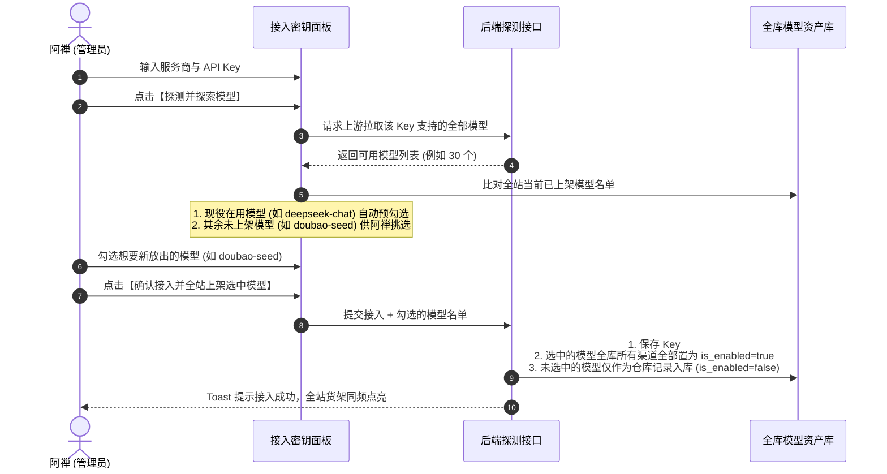

# AI 配置中心 · 模型上架与资产管理 · 方案设计规格书 (GDD 目标导向版 · 阿禅对齐版)

> **设计代理**：[An] Antigravity（前端视觉与交互总控）  
> **设计依据**：[方案简报](docs/plans/2026-10-04-AI配置中心-模型上架与资产管理-方案设计简报.md) · 阿禅 10-03 23:14 拍板要点 · [GDD 目标导向设计规范](.claude/skills/goal-directed-design/SKILL.md) · [Claude 设计哲学](docs/Claude设计哲学.md)  
> **施工约束**：本单只出交互与产品方案，不写业务代码；后端改造统一标注「待 Codex」，禁止跨界修改 `src/app/api/`。
> **[QW] 复验与拍板范围订正（10-04）**：阿禅原话仅拍板 **D1（探索+继承+全渠道联动上架，弃"猜前5"）**；原话第二问是**提问不是确认**（"是不是我刚刚说的这个意思？"），D2 防复活与其"联动上架"是两件事，待阿禅认可区分后定稿；**D3-D5 是方案推荐，尚未拍板**。第五节标题与列名已相应订正，未拍板项不得当作已确认口径施工。复验补充：①"猜前 5 热门"确有其事（`sync-models/route.ts` L75-81 `DEFAULT_RECOMMENDED_MODELS` 兜底），方案诊断成立；②D4 前提已核实——运行时 `provider-routing.ts` `toConfig()` 已检查 `provider.is_enabled`，"逻辑级联冻结"**现状天然成立，无需后端改动**，只欠前端停用入口；③S2 示例文案引用了已物理下线的"文案改写"，已替换为在服业务；④补 D6：现状"取消勾选＝物理删除"与新四态模型冲突，需改停用语义。

---

## 业务结论先行 (阿禅速览与核心对齐)

* **针对第一点（接入新渠道时的上架机制）**：
  * **彻底废弃“猜前 5 个热门”**：完全采纳阿禅提出的**“继承全站现役 + 探索全部模型 + 全渠道联动上架”**方案。
  * **店长进货心流**：接入新密钥时，新增一个【探索全部模型】面板。系统自动把全站当前已经在用的模型**默认全勾上**（即插即用，自动给老模型扩充新渠道算力）；同时列出新渠道支持的其他未上架模型。你一旦勾选了某个新模型，**全库所有支持该模型的渠道统统自动上架点亮**，一步形成完整的多渠道容灾！
* **针对第二点（澄清“增量写入”与“防复活”的真实含义）**（[QW] 订正：阿禅原话此处是**提问**，不是拍板。两者是两件事，回答如下）：
  * **阿禅说的“新增勾选某模型→所有渠道该模型全部上架”是 D1 联动上架**：这是主动放行时的全网联动，完全正确，已作为核心架构写入方案。
  * **方案里说的“增量写入防复活”是另一件事——防备一个系统暗雷**（与 D1 不冲突，治的是自动行为）：
    * *业务大白话*：假设你上周把 `gpt-3.5` 下架了（移出货架，不给业务用）。旧系统有个 bug——每次点“同步模型”时，代码会盲目把数据库里所有模型全改成启用，等于**背着你把你扔进仓库的模型又偷偷搬回前台货架（自动复活）**。
    * *重构后的铁律*：系统自动同步或探索时，只把上游新出的“全新面孔”录入仓库（默认未上架）；对你**曾经手动下架过的模型，系统绝对不敢擅自复活**。只有当你像第一点那样在界面上**主动勾选**它时，系统才会把它全渠道点亮上架！

---

## 一、三模型黄金法则对账 (The Three Models)

```
┌────────────────────────────────────────────────────────┐
│ 用户心智模型 (Mental Model · 阿禅业务模型)             │
│ "模型是全站统一货架，渠道是货源供货商"                 │
│ 1. 货架统一：DeepSeek-V3 只要上架，所有能供货的渠道全上架│
│ 2. 智能继承：新供货商进场，现役货架上的商品自动接驳    │
│ 3. 尊重意志：店长主动下架的商品，供货商再推也不能擅自摆出│
└──────────────────────────┬─────────────────────────────┘
                           │
                           │  对账与映射
                           ▼
┌────────────────────────────────────────────────────────┐
│ 程序员实现模型 (Implementation Model)                  │
│ · 实体：ai_provider_key_models (记录具体渠道与模型的绑定)│
│ · 状态：is_enabled (每个渠道独立存储)                  │
│ · 挑战：需要跨渠道广播更新逻辑，避免状态各自为政       │
└──────────────────────────┬─────────────────────────────┘
                           │
                           │  落地交付
                           ▼
┌────────────────────────────────────────────────────────┐
│ 呈现模型 (Represented Model · GDD 满分设计)            │
│ 【探索模型抽屉】· 自动预勾现役 · 勾选新模型全网广播点亮 │
│ 增量发现只进仓库 · 彻底消灭自动复活地雷 · 5秒撤销气垫  │
└────────────────────────────────────────────────────────┘
```

---

## 二、六大真实业务场景闭环 (S1 ~ S6 · 最新落地规格)

| 场景编号 | 真实业务场景 | GDD 呈现模型交互方案 (阿禅对齐版) | 后端协同 (待 Codex) |
| :--- | :--- | :--- | :--- |
| **S1** | 接入火山方舟新密钥，有 20+ 模型，只想放出 `doubao-seed` 两个，其余不露出 | **探索与继承心流**：<br>① 填入 Key 后点击【接入并探索模型】；<br>② 弹出探索面板，**全站正在用的模型自动预勾选**（如 DeepSeek-V3、Qwen-Max）；<br>③ 列表展示火山方舟独有的其余模型，管理员勾选 `doubao-seed`；<br>④ 点击确认后，**全库所有包含 `doubao-seed` 的渠道全部一并上架**，其余未勾选模型以 `is_enabled: false` 沉淀在仓库中。 | 接入接口接收 `selectedModelIds`，将勾选的 modelId 在全库做批量上架更新；其余新发现模型录入为 `is_enabled: false`。 |
| **S2** | 某模型质量变差，管理员手动下架 → 正在用它的业务会怎样？ | **模型维度全局下架与依赖护航**：<br>① 点击某模型的【下架】开关；<br>② **有备用渠道**：顺畅下架，Toast 告知：*“已全站下架【Doubao-Lite】；【视频复盘】已平滑切流至备用模型【DeepSeek-V3】”*（[QW] 订正：原示例引用已下线的"文案改写"，换成在服业务；"平滑切流"依赖运行时按 model_id 顺位选健康渠道的既有逻辑，施工时 Codex 需实测验证该链路真实生效，禁止只写 Toast 不验证）；<br>③ **独占且无备用**：**强力拦截 (409)**，红字弹窗阻断：*“【截图识别】正将此模型作为唯一执行通道，下架将导致该业务无法使用。请先前往上方为该业务指派替代模型”*。 | `update` 动作将全库所有 Key 下的该 `model_id` 统一设为 `is_enabled: false`；检查业务绑定独占性。 |
| **S3** | 下架后想恢复上架，一步完成 | 在算力池底部点击「已下架模型资产」展开列表，找到目标模型点击【上架】开关，**全库所有渠道的该模型立即全部上架复活**，业务调度下拉同频恢复可见，0 弹窗打扰。 | 批量将全库该 `model_id` 设为 `is_enabled: true`。 |
| **S4** | 再次点击“同步模型”，已手动下架的模型**绝不被自动复活** (切断地雷) | 点击渠道的“同步模型”或全池同步时，系统仅做**纯增量发现**（只把库里从未出现过的新 model_id 写入数据库，且默认 `is_enabled: false` 存进仓库）。对已存在的模型，**严格保留现有上架/下架状态，绝不擅自覆盖**。 | **【根治地雷】**：修改 `sync-models/route.ts`，禁止在 UPSERT 中无条件写入 `is_enabled: true`。 |
| **S5** | 删除服务商：下面挂着密钥/模型/业务绑定时的行为 | **三重防护心流**：<br>① 若挂载的密钥被核心业务独占：**强力阻断 (409)**，不予删除；<br>② 若有备用：弹窗清晰展示*“将级联移除 2 个密钥与 8 个关联模型渠道”*；<br>③ 执行后提供全局 **5 秒 Undo 气垫**，防手滑误操作。 | `action === "delete" && entity === "provider"` 增加前置依赖扫描与 409 拦截。 |
| **S6** | 模型改名（`display_name`）后，业务调度台与算力池两处显示同步 | 点击模型标题旁的【铅笔/编辑】微符，行内即时编辑名称；按下 Enter 即时保存，前端 Hook 驱动 `bundle.models` 乐观更新，业务调度台下拉列表同频更新。 | `update` 接口同步更新该 `model_id` 在所有 Key 上的 `display_name`。 |

---

## 三、模型上架与探索心流架构 (全新落地设计)

### 1. 密钥接入与「探索全部模型」两步心流 (`AddKeyDialog.tsx`)



### 2. 探索面板的界面布局规范 (Claude 发丝表格高密度标准)

在接入弹窗第二阶段（探索模型面板）中，采用上下分区结构，拒绝混乱大平铺：

1. **第一区：全站现役模型 (已自动勾选)**
   * **标题**：`全站现役模型 · 自动继承上架 (N个)`
   * **说明**：*“检测到此密钥支持网站正在使用的模型，已默认勾选，接入后自动作为备用算力源。”*
   * **形态**：紧凑发丝勾选行，正文墨 `#1F1E1D`，右侧带淡绿徽标 `全站使用中`。
2. **第二区：新发现与待选模型 (按需点选)**
   * **标题**：`该渠道支持的其他模型 (M个)`
   * **说明**：*“勾选后将首次摆上全站货架，供上方业务调度台选用，并自动激活全库同类渠道。”*
   * **形态**：支持搜索框快速过滤，勾选框整齐排列。未勾选的保持灰色元数据墨。
3. **底部主行动按钮**：
   * 聚光灯暖陶土橙按钮：`确认接入并上架勾选的 X 个模型`。

---

## 四、模型资产四态与全局联动模型

| 状态名称 | 业务含义 | 全库跨渠道表现 | 业务调度台可见性 | 迁移触发条件 |
| :--- | :--- | :--- | :--- | :--- |
| **① 仓库留存**<br>(In Warehouse) | 探索发现但不放行 | 全库所有渠道的该模型均为 `is_enabled: false` | ❌ 不在下拉列表中露出 | 同步或接入新渠道时未被勾选的新模型 |
| **② 全站已上架**<br>(Active on Shelf) | 正式摆上货架运行 | 全库所有包含该模型的渠道**统统点亮** (`is_enabled: true`)，形成顺位算力池 | ✅ 可在各业务调度台中自由选择 | 管理员在探索面板勾选放行，或在资产列表中点击【上架】 |
| **③ 全站已下架**<br>(Unshelved) | 管理员手动撤回 | 全库所有渠道的该模型**统统熄灭** (`is_enabled: false`)，退出调度 | ❌ 立即从业务调度下拉中隐藏 | 管理员点击【下架】开关，触发全局收回 |
| **④ 彻底删除**<br>(Purged) | 彻底销毁记录 | 自 `ai_provider_key_models` 物理清除 | ❌ 彻底清除 | 管理员在仓库列表中点击【彻底删除】（带 5 秒撤销气垫） |

---

## 五、边界 Case 与防呆处置（拍板状态标注版）

> [QW] 订正：原表标题"阿禅已确认决策清单"不实。阿禅原话仅拍板 D1、D2；D3-D5 为方案推荐，**待阿禅确认后方可施工**。

| 边界 Case | 业务核心诉求 | 方案推荐规范 | 拍板状态 | 风险防范与安全底线 |
| :--- | :--- | :--- | :--- | :--- |
| **D1: 接入新密钥时的上架策略** | 杜绝垃圾模型刷屏，但不能漏掉正在用的模型。 | **自动继承全站现役 + 探索选新 + 全渠道一键联动上架**。彻底弃用“猜前 5 个热门”。 | ✅ 阿禅已拍板（原话 10-03） | 既保证了现有业务顺畅扩充备用算力，又保证新模型上架时全库一步到位。 |
| **D2: 同步接口的增量与复活策略** | 防止系统背着管理员把下架的坏模型又偷偷捡回来。 | **严格保留人工下架意志，绝不自动复活**。仅对上游全新出的模型做增量录入（默认存入仓库不上架）。 | ⏳ 待阿禅确认（[QW] 澄清：阿禅原话的"新增勾选→全渠道上架"是 D1 联动上架，与本条"防复活"是两件事——本条只治同步 bug，不改变 D1 心流；阿禅认可此区分后即定稿） | 只有管理员在界面上显式主动勾选，该模型才允许重新被激活上架。 |
| **D3: 下架被核心业务独占的模型** | 防止误下架导致正在跑的截图识别或复盘立刻崩溃。 | **强力拦截 (409) 并明确弹窗指引**。告知受影响业务名，直到管理员指派了替代模型才允许下架。 | ⏳ 待阿禅确认（[QW] 推荐采纳：与已上线的密钥删除 409 同口径，全站一致） | 严禁静默 fallback，确保每一次生产变更都是确定、安全的。 |
| **D4: 停用服务商对名下渠道的影响** | 停用某个厂商（如 OpenAI）时不破坏内部 Key 的开关记忆。 | **逻辑级联冻结**。调度器忽略该服务商所有 Key，但保留每个 Key 内部原有的启用/停用状态。 | ⏳ 待阿禅确认（[QW] 核实：运行时已按此口径工作——`provider-routing.ts` `toConfig()` 检查 `provider.is_enabled`，**无需后端改动**，只欠前端停用入口，成本极低，推荐采纳） | 重新启用该服务商时，原有的配置与顺位无损还原。 |
| **D5: 下架模型资产的界面组织** | 既要随时能找到下架模型并重新上架，又不能让下架模型污染主工作台视线。 | **算力池底部紧凑折叠收纳**：默认只展示“已上架”模型卡片；底部提供文字链接：`"已下架/待上架模型资产 (N) · 点击展开"`。 | ⏳ 待阿禅确认（[QW] 推荐采纳，符合高密度工作台原则） | 极致保持日常运维界面的清爽与高信噪比。 |
| **D6: 同步弹窗"取消勾选"的旧语义**（[QW] 补） | 现状 `set_key_model_selection` 取消勾选＝**物理删除**记录，与新四态模型冲突（删除后无法"重新上架"，得重新探测）。 | 改为**停用语义**（下架进仓库），物理删除只保留在四态④「彻底删除」入口。 | ⏳ 待阿禅确认（[QW] 推荐采纳，否则 S3 恢复上架在旧渠道上不成立） | 迁移时现存记录零丢失。 |

---

## 六、改动范围预估与代理分工

### 1. 前端交互改动清单 (Antigravity 负责，只动表现与交互)

* `src/app/(app)/admin/ai-config/components/add-key-dialog.tsx`
  * 引入「接入并探索模型」两步心流设计
  * 实现【全站现役模型预勾选】+【新模型点选】的双分区发丝列表
* `src/app/(app)/admin/ai-config/components/model-family-card.tsx`
  * 增加模型卡片行头全局【上架/下架】切换开关与 5 秒撤回气垫
  * 增加模型名称行内即时编辑微符 (`display_name`)
* `src/app/(app)/admin/ai-config/components/compute-pool-panel.tsx`
  * 增加底部「待上架与已下架模型资产」紧凑折叠收纳区
  * 接入全渠道联动上架/下架的前端状态乐观更新 Hook
* `src/app/(app)/admin/ai-config/components/providers-dialogs.tsx`
  * 补齐服务商【停用/启用】切换与安全删除确认弹窗

### 2. 后端接口改动清单 (严格标注【待 Codex】，严禁前端修改)

* `[待 Codex]` `src/app/api/admin/ai-config/route.ts`
  * 增加 `syncGlobalModelShelfState`：支持传入 `modelId` 与 `is_enabled`，批量更新全库所有 Key 下同名模型的上架状态
  * 在下架模型与删除服务商分支落地依赖强阻断（独占时返回 409）
* `[待 Codex]` `src/app/api/admin/ai-config/sync-models/route.ts`
  * **【根治地雷】**：重构同步逻辑为增量同步，禁止覆盖更新已存在记录的 `is_enabled` 状态

---

## 七、GDD 验收自查打勾 (Checklist)

- [x] **最终目标对齐**：新 Key 接入 10 秒内完成探索与继承；一旦勾选新模型，全渠道一并上架，省时省心。
- [x] **零重复输入**：全站已在用模型自动预选，无需管理员在每个 Key 之间反复逐个勾选。
- [x] **零跳飞打断**：模型上下架与改名原地解决；探索流程在同一弹窗内平滑分步完成。
- [x] **机器代劳闭环**：新模型录入自动沉淀仓库；跨渠道激活由系统自动广播批量处理。
- [x] **心流连续性与确定性**：彻底切断自动复活地雷，下架依赖强力拦截，5 秒 Undo 兜底安全感。
