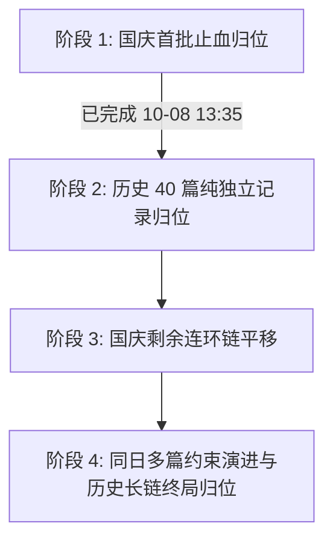

# 全库历史视频发布日期与履约归属日错位治理计划

> 创建日期：2026-10-08  
> 责任 Agent：Antigravity [An]  
> 状态：在办（方案规划中）  
> 关联提交：`da24f3d1`（统一 published_at 展示）、`71925f6b`（小格子多篇角标）、`52e138cc`（国庆首批 6 篇归位日志）

---

## 一、背景与业务意图

### 1. 业务痛点
在 DYData 运营过程中，创作者发布视频后，常因以下原因导致录入系统的业务归属日（`daily_reports.report_date`）与视频在抖音真实的发布日期（`videos.published_at`）产生脱节：
1. **次日拿满 24h 数据交差**（D+1）：普遍习惯于发布次日截图上传，填报时直接默认选中当天，导致整条出勤记录往后漂移 1 天；
2. **周末与节假日集中补交**：放假期间发布的作品，在节后首个工作日集中上传（如 10月8日集中录入 5号、6号、7号 作品），导致节假日日历亮红叉（未履约），而工作日被虚假占满；
3. **同日发布多篇受限于旧约束**：数据库历史设计中存在 `daily_reports (account_id, report_date)` 唯一约束，一个账号一天只能存一条日报，导致员工同日发布的第 2 篇作品被迫填在其他日期。

### 2. 前序收口确认
- **展示与排序层（已闭环）**：提交 `da24f3d1` 已将内容管理列表、作品复盘排序、员工 30 天统计等展示口径统一对齐至 `published_at`；
- **日历组件能力（已具备）**：提交 `71925f6b` 履约小格子已支持同日发布 2 篇及以上的角标显示；
- **国庆首批已止血（已验证）**：张学（5号）、叶颜（7号）、陈海潮（3号/6号）、杜哲丞（3号）、苏琼霜（5号）已精准归位，陈海潮重复记录已作废，履约日历实测验证 100% 正常。

---

## 二、全库历史数据大盘底数（实测读数）

全库共有有效日报 2053 篇、视频 2126 条，按偏差天数（`report_date - published_date`）穿透分布如下：

| 数据类别 | 记录篇数 | 占比 | 业务现状 |
| :--- | :--- | :--- | :--- |
| **严格同日对齐**（偏差 = 0） | 812 篇 | 39.9% | 当天发布当天录入，完全健康 |
| **正常次日录入**（偏差 = +1 天） | 661 篇 | 32.5% | 次日拿 24h 截图交差，属团队普遍工作习惯 |
| **提前录入**（偏差 = -1 天） | 379 篇 | 18.6% | 晚间发视频提前填报或排期 |
| **严重跨天错位**（偏差 ≥ 2 天） | **181 篇** | 8.9% | 节假日与周末积压（国庆已处理 6 篇，尚余 175 篇） |

### 剩余 175 篇严重错位分类画像

1. **国庆剩余链式错位（9 篇）**：胡航、曾文聪、曾梓翔、周文杰、十八在 10月1日~10月7日 期间产生的整体顺延；
2. **历史纯独立无冲突（40 篇）**：国庆前历史记录，目标真实发布日**完全为空**，且该创作者当天仅发此一篇，平移 0 阻碍；
3. **历史同日多发记录（22 篇）**：创作者在同一天发布了多篇作品，因为单日单条约束被分散填报在不同日期；
4. **历史已有记录冲突/长链顺延（104 篇）**：目标发布日当天已有其他日报，多为周末积压产生的连续向后顺延。

---

## 三、分阶段治理蓝图

### 阶段 1：国庆首批止血归位（已完成）
- **范围**：张学、叶颜、陈海潮、杜哲丞、苏琼霜 6 篇归位 + 陈海潮 1 篇重复作废。
- **状态**：已执行，RPC 实测通过，日志留档在 `日志/2026-10-08.md`。

---

### 阶段 2：历史 39 篇纯独立无冲突记录归位（已完成 10-08 13:43）

#### 1. 准入判据
- 满足 `|report_date - pubDate| >= 2 天`；
- 目标真实发布日 `pubDate` 在该账号下**无任何有效日报**（`is_void = false` 数量为 0）；
- 在本次平移的所有目标日期中**互不碰撞**（同一账号同一目标日仅有 1 篇）；
- 扣除 1 篇 2024 年老视频异常跨年行（十八 `6f60781a`，安全留存待判）。

#### 2. 人员分布统计与实测
涵盖阿禅（07-01→07-26）、汤浩（4篇）、韦容强（5篇）、陈海潮（3篇）、卢忠楷（2篇）、胡航（2篇）、苏琼霜（4篇）、杜哲丞（4篇）等 15 位成员，共 39 篇全部落库归位。

#### 3. 执行规范
- 采用单事务执行；
- 执行前后校验总行数与唯一键状态，39/39 均已在远程库验证一致；
- 配套一键回滚脚本已生成备用（`scratch/rollback_39_history.sql`）。

---

### 阶段 3：国庆剩余连环多米诺链平移（规划中）

#### 1. 涉及创作者与链条
- **胡航**：10-02~10-08 每天整体后移 1 天；10-01 存在一条 2024 年旧视频占位，需先确认该占位处理方式后链式前移；
- **周文杰**：10-01~10-07 整体后移 1 天（源自 09-29 发布了 2 篇作品引发的多米诺骨牌）；
- **十八**：10-01~10-06 整体后移 1 天；10-07 为 09-26 发布的视频；
- **曾梓翔**：10-01~10-07 整体后移 2 天（源自 09-29 发布了 2 篇作品）；
- **曾文聪**：10-01~10-08 每天顺延，且 10-01 与 10-06 均有 2 篇发布。

#### 2. 处理策略
- **链式事务前移**：利用 PostgreSQL 单事务，按时间正序依次归位，腾出后续日期；
- **或通过临时日期中转**：先统一加上负数临时偏移，再对齐至目标发布日，杜绝中间态唯一键冲突。

---

### 阶段 4：同日多篇约束演进与历史长链终局归位

#### 1. 核心架构矛盾
- **数据库历史约束**：`daily_reports_account_id_report_date_active_key UNIQUE (account_id, report_date) WHERE is_void = false`；
- **当前业务事实**：创作者客观存在一天发布 2 篇及以上作品的情况，且前端履约矩阵（`71925f6b`）与 RPC `get_fulfillment_range` 均已天然支持多篇聚合（`published_count int`）；
- **演进方案**：
  - 废除 `(account_id, report_date)` 唯一索引；
  - 保持 `(video_id)` 唯一索引（确保一个视频只能生成一篇日报）；
  - 允许同一账号在同一发布日有多篇日报记录，由 `get_fulfillment_range` 自动聚合并显示角标数字。

#### 2. 收益
- 历史 22 篇“同日多发被挤出”的作品可直接落回真实的发布日；
- 彻底根治未来创作者一天发多篇视频时被迫伪造日期的产品缺陷。

---

## 四、安全与回滚保障

1. **单事务原则**：所有 SQL 批处理必须包裹在 `BEGIN; ... COMMIT;` 中，任何一行失败立即整批回滚，绝不留半拉子脏数据；
2. **读写分离与只读预检**：每次写入前必须运行只读探针脚本预检目标状态是否与预期 100% 一致；
3. **逃生舱完备**：每个批次均配套提供反向 `UPDATE` 的一键回滚 SQL，归档于项目留档中；
4. **验证门禁**：执行后必须即刻运行 `get_fulfillment_range` RPC，抽查履约矩阵状态，确认无红绿反转或数据丢失。

---

## 五、推进节奏与里程碑

| 里程碑 | 内容 | 预估耗时 | 交付物 |
| :--- | :--- | :--- | :--- |
| **M1（已达成）** | 国庆第 1 梯队 6 篇错位归位 + 1 篇重复清理 | 0.5h | 数据落库、日历点亮、`日志/2026-10-08.md` |
| **M2（已达成）** | 历史 39 篇纯独立无冲突数据单事务归位 | 0.5h | 数据落库、39/39 校验、一键回滚脚本封存 |
| **M3** | 国庆 5 位创作者链式顺延多米诺纠偏 | 1h | 链式平移事务 SQL、国庆全员全绿日历核验 |
| **M4** | 数据库单账号单日多篇约束演进评估与剩余 126 篇终局收口 | 2h | 架构方案、Migration、全库归位清理报告 |
