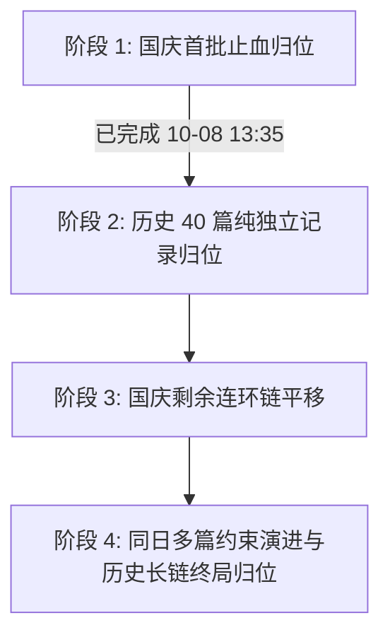

# 全库历史视频发布日期与履约归属日错位治理计划

> 创建日期：2026-10-08  
> 责任 Agent：Antigravity [An]  
> 状态：在办（阶段1/2已闭环，阶段3/4依审计结论暂停等待应用层改造）  
> 关联提交：`da24f3d1`（统一 published_at 展示）、`71925f6b`（小格子多篇角标）、`52e138cc`（国庆首批 6 篇归位日志）、`20261008143000`（修复履约RPC排除作废日报）  
> 审计台账：[阶段2历史39篇数据归位对账与回滚留档](../reference/2026-10-08-阶段2历史39篇数据归位对账与回滚留档.md)

---

## 一、背景与业务意图

### 1. 业务痛点
在 DYData 运营过程中，创作者发布视频后，常因以下原因导致录入系统的业务归属日（`daily_reports.report_date`）与视频在抖音真实的发布日期（`videos.published_at`）产生脱节：
1. **次日拿满 24h 数据交差**（D+1）：普遍习惯于发布次日截图上传，填报时直接默认选中当天，导致整条出勤记录往后漂移 1 天；
2. **周末与节假日集中补交**：放假期间发布的作品，在节后首个工作日集中上传（如 10月8日集中录入 5号、6号、7号 作品），导致节假日日历亮红叉（未履约），而工作日被虚假占满；
3. **同日发布多篇受限于旧约束**：数据库历史设计中存在 `daily_reports (account_id, report_date)` 唯一约束，一个账号一天只能存一条日报，导致员工同日发布的第 2 篇作品被迫填在其他日期。

### 2. 前序收口确认
- **展示与排序层（已闭环）**：提交 `da24f3d1` 已将内容管理列表、作品复盘排序、员工 30 天统计等展示口径统一对齐至 `published_at`；
- **日历组件能力（已具备）**：提交 `71925f6b` 履约小格子已支持同日发布 2 篇及以上的角标显示；
- **国庆首批已止血（已验证）**：张学（5号）、叶颜（7号）、陈海潮（3号/6号）、杜哲丞（3号）、苏琼霜（5号）已精准归位，陈海潮重复记录已作废，履约日历实测验证 100% 正常。

---

## 二、全库历史数据大盘底数（实测读数）

全库共有有效日报 2053 篇、视频 2126 条，按偏差天数（`report_date - published_date`）穿透分布如下：

| 数据类别 | 记录篇数 | 占比 | 业务现状 |
| :--- | :--- | :--- | :--- |
| **严格同日对齐**（偏差 = 0） | 812 篇 | 39.9% | 当天发布当天录入，完全健康 |
| **正常次日录入**（偏差 = +1 天） | 661 篇 | 32.5% | 次日拿 24h 截图交差，属团队普遍工作习惯 |
| **提前录入**（偏差 = -1 天） | 379 篇 | 18.6% | 晚间发视频提前填报或排期 |
| **严重跨天错位**（偏差 ≥ 2 天） | **181 篇** | 8.9% | 节假日与周末积压（国庆已处理 6 篇，尚余 175 篇） |

### 剩余 175 篇严重错位分类画像

1. **国庆剩余链式错位（9 篇）**：胡航、曾文聪、曾梓翔、周文杰、十八在 10月1日~10月7日 期间产生的整体顺延；
2. **历史纯独立无冲突（40 篇）**：国庆前历史记录，目标真实发布日**完全为空**，且该创作者当天仅发此一篇，平移 0 阻碍；
3. **历史同日多发记录（22 篇）**：创作者在同一天发布了多篇作品，因为单日单条约束被分散填报在不同日期；
4. **历史已有记录冲突/长链顺延（104 篇）**：目标发布日当天已有其他日报，多为周末积压产生的连续向后顺延。

---

## 三、分阶段治理蓝图

### 阶段 1：国庆首批止血归位（已完成）
- **范围**：张学、叶颜、陈海潮、杜哲丞、苏琼霜 6 篇归位 + 陈海潮 1 篇重复作废。
- **状态**：已执行，RPC 实测通过，日志留档在 `日志/2026-10-08.md`。

---

### 阶段 2：历史 39 篇纯独立无冲突记录归位（已完成且对账留档）

#### 1. 准入判据
- 满足 `|report_date - pubDate| >= 2 天`；
- 目标真实发布日 `pubDate` 在该账号下**无任何有效日报**（`is_void = false` 数量为 0）；
- 在本次平移的所有目标日期中**互不碰撞**（同一账号同一目标日仅有 1 篇）；
- 剔除 1 篇 2024 年老视频异常跨年行（十八 `6f60781a`，安全留存待判）。

#### 2. 人员分布统计与实测
涵盖阿禅（07-01→07-26）、汤浩（4篇）、韦容强（5篇）、陈海潮（3篇）、卢忠楷（2篇）、胡航（2篇）、苏琼霜（4篇）、杜哲丞（4篇）等 15 位成员，共 39 篇全部落库归位。

#### 3. 执行规范与可审计留档
- 采用单事务执行；
- 执行前后校验总行数与唯一键状态，39/39 均已在远程库验证一致；
- **正式台账**：完整明细与外键核验证据已归档至 [阶段2历史39篇数据归位对账与回滚留档](../reference/2026-10-08-阶段2历史39篇数据归位对账与回滚留档.md)；
- **受控回滚脚本**：内置防状态漂移预检逻辑的回滚 SQL 已归档至 [2026-10-08-阶段2历史39篇受控回滚.sql](../reference/2026-10-08-阶段2历史39篇受控回滚.sql)。

---

### 阶段 3：国庆剩余连环多米诺链平移（当前受控暂停）

> **暂停说明**：根据 10-08 独立审计结论，后续批次如果不同时核对日期型履约标记（如苏琼霜 10-05 存在请假/豁免申请，其余成员可能存在人工标记），可能产生“日报已归位，但请假/豁免仍留在旧日期”的账实错位。因此本阶段暂不继续批量写入，待完成日期标记联动校验设计后推进。

#### 1. 涉及创作者与链条
- **胡航**：10-02~10-08 每天整体后移 1 天；10-01 存在一条 2024 年旧视频占位，需先确认该占位处理方式后链式前移；
- **周文杰**：10-01~10-07 整体后移 1 天（源自 09-29 发布了 2 篇作品引发的多米诺骨牌）；
- **十八**：10-01~10-06 整体后移 1 天；10-07 为 09-26 发布的视频；
- **曾梓翔**：10-01~10-07 整体后移 2 天（源自 09-29 发布了 2 篇作品）；
- **曾文聪**：10-01~10-08 每天顺延，且 10-01 与 10-06 均有 2 篇发布。

#### 2. 处理策略
- 重新生成全量候选清单，每条记录严格绑定 `video_id`、真实上海发布日、原日期、目标日期、冲突状态；
- 核验平移期间是否存在 `fulfillment_records`（缺勤/免交/补交）或 `exemption_request`（请假/报备），建立联动平移机制；
- 链式事务前移或临时负数偏移中转。

---

### 阶段 4：同日多篇约束演进与历史长链终局归位（当前受控暂停）

> **审计阻断项**：阶段 4 严禁“直接在数据库 drop index 了事”。如果仅删除唯一索引，将直接击穿应用层多处隐式假设，导致提交失败、编辑报错 500、错误删除同日其他作品等严重事故。**必须先完成应用层 4 处关键改造并验证通过，方可执行数据库索引迁移**。

#### 1. 应用层必须先行的 4 处改造
1. **作品提交入口（`src/app/api/video-submit/route-core.ts`）**：
   - 当前在 388 行仍主动执行 `account_id + report_date` 查重并抛出 409 阻断；
   - 改造：废除按账号+日期的拦截，改为基于 `video_id` 的唯一性拦截（允许同账号同日录入不同作品）。
2. **日报编辑入口**：
   - 当前使用 `.maybeSingle()` 查询指定日期的日报，若同账号同日存在多篇将抛出多行异常导致 500；
   - 改造：编辑入口全面改为基于日报 `id` 或 `video_id` 进行单行精确定位。
3. **提交异常回滚逻辑**：
   - 当前在插入失败时使用 `delete().eq('account_id', ...).eq('report_date', ...)`；
   - 改造：必须改为仅按本次事务刚插入的精确日报 `id` 执行回滚删除，严禁误删同日已存在的其他作品。
4. **协作异常匹配**：
   - 当前存在按账号+日期的兜底模糊匹配逻辑，同日多视频后会产生匹配歧义（ambiguous）；
   - 改造：全面收敛为基于 `video_id` 或作品标题+创作者的确定性匹配。

#### 2. 数据库索引演进（应用层就绪后再执行）
- 废除 `daily_reports_account_id_report_date_active_key UNIQUE (account_id, report_date) WHERE is_void = false`；
- 保持 `daily_reports_video_id_key UNIQUE (video_id)` 唯一索引；
- 履约 RPC `get_fulfillment_range` 已支持多篇聚合（`published_count int`），前端日历已支持多篇角标。

---

## 四、安全与回滚保障

1. **单事务原则**：所有 SQL 批处理必须包裹在 `BEGIN; ... COMMIT;` 中，任何一行失败立即整批回滚，绝不留半拉子脏数据；
2. **读写分离与只读预检**：每次写入前必须运行只读探针脚本预检目标状态是否与预期 100% 一致；
3. **合格回滚标准**：
   - 保存 ID、原始日期、当前日期、is_void、review_status、video_id；
   - 批次号与执行时间留档；
   - 执行前校验哈希与当前值防漂移断言，若有任意一行被二次修改则批次拒绝回滚；
4. **验证门禁**：执行后必须即刻运行 `get_fulfillment_range` RPC，抽查履约矩阵状态，确认排除作废且多篇正确聚合。

---

## 五、推进节奏与里程碑

| 里程碑 | 内容 | 预估耗时 | 状态 | 交付物 |
| :--- | :--- | :--- | :--- | :--- |
| **M1（已达成）** | 国庆第 1 梯队 6 篇错位归位 + 1 篇重复作废清理 | 0.5h | 已完成 | 数据落库、日历点亮、`日志/2026-10-08.md` |
| **M2（已达成）** | 历史 39 篇纯独立无冲突数据单事务归位与留档 | 0.5h | 已完成 | 39篇全量对账表、可审计回滚SQL、`docs/reference/` 留档 |
| **M0（已达成）** | 履约 RPC 修复：`get_fulfillment_range` 排除作废日报 | 0.5h | 已完成 | 生产 Migration、陈海潮 10-02 实测已恢复未交 |
| **M3（暂停）** | 履约标记联动机制设计 + 国庆多米诺链前移 | 1h | 暂停排查 | 全量候选清单、请假标记联动方案、链式平移事务 |
| **M4（暂停）** | 同日多发应用层 4 处改造 + 数据库唯一索引演进 | 2h | 等待改造 | 提交/编辑/回滚/协作代码重构、回归测试、Migration |

