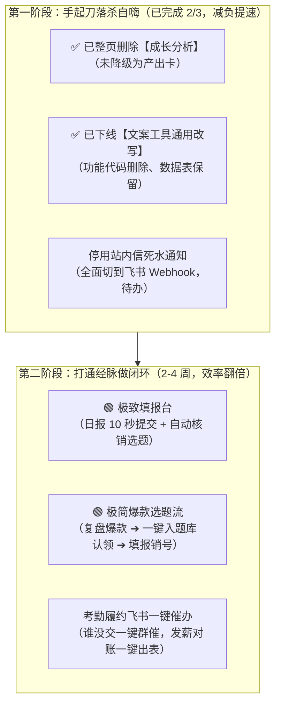

# 全站产品深度审计与瘦身路线（2026-09-26 合并版）

> **核心定调**：DYData 目前有一半是在帮团队算账发工资（真核心），另一半是在扮演“高科技大厂仪表盘”（自嗨假需求）。真正的价值只有两条线：**员工填日报领工资、管理层查履约抓爆款**；凡是跟“算考勤、发绩效、抄爆款、催交付”无关的所谓 AI 改写、成长雷达、纯观赏图表，全是在浪费开发算力与员工精力。

> **执行进展（2026-09-26 更新）**：本报告「第一阶段：手起刀落杀自嗨」已落地。【成长分析 `/growth`】**整页删除**（提交 `3030bad2`，含导航「数据分析」入口、页面与专属组件）；【文案助手 `/content-tools/rewrite`】**已下线并删除功能代码**（提交 `a94cbb7b`，保留页面为「已下线」提示页、17 张 `rewrite_*`/`ai_*` 数据表原地保留）。两者均已推送 main。原挂在成长分析下的**排行榜已保留**，并已并入「数据管理 `/admin/collaboration`」的【账号排行】页签。本文以下「裁决 / 行动」中涉及这两个模块的条目，已按实际执行结果改写。

---

## 一、全站模块评分总览

| 页面 / 模块 | 路由 | 评分 | 一句话定性 | 核心状态 |
| :--- | :--- | :---: | :--- | :--- |
| **工作台（数据看板）** | `/dashboard` | **8.8** | 全站命根子，流水线工兵台 | ✅ 极高效，持续微调 |
| **视频复盘** | `/admin/content` | **8.5** | 管理端第一重器，数据穿透力极强 | ✅ 核心生产力 |
| **豁免审批抽屉** | 顶栏 CommandHub | **8.7** | 轻量即焚的极佳交互范式 | ✅ 标杆体验 |
| **数据管理（协作）** | `/admin/collaboration` | **8.2** | 四岗跨账号算账神器，分润定级抓手 | ✅ 业务闭环完整 |
| **选题库** | `/topics` | **8.0** | 业务逻辑跑通的矩阵弹药库 | ✅ 实用且克制 |
| **成员与权限** | `/admin/modules` | **7.8** | 规矩扎实的组织后台 | ✅ 稳定可用 |
| **发布管理** | `/admin/fulfillment` | **7.5** | 铁面考勤机，但缺少抓手推进闭环 | 🟡 需强化催办闭环 |
| **AI 配置中枢** | `/admin/ai-config` | **7.0** | 纯技术底座中继站 | 🟡 运维工具属性 |
| **系统设置** | `/admin/settings` | **6.5** | 过于简陋的参数页 | 🟡 需收口 |
| **AI 文案改写** | `/content-tools/rewrite` | **5.0** | 缝合了 Chat 交互的半成品工坊 | ⛔ **已下线**（2026-09-26） |
| **成长分析** | `/growth` | **4.2** | 典型的自嗨型 AI 仪表盘玩具 | ⛔ **已整页删除**（2026-09-26） |

---

## 二、逐模块审计：证据、判词、裁决

### 1. 工作台 `/dashboard` —— 8.8 分（顶级工作台）

**证据天梯**：不填今天就记缺卡/扣绩效；停服半天微信群立刻炸锅；没有它团队立马退回发微信截图与手抄 Excel。顶级真需求。

**好的地方**：极其克制。首页没有堆砌花哨折线图，而是把“今天交了没、该交哪个账号、截图自动 OCR 填数”做成一条直线。OCR 识别把过去手抄数据 10 分钟压到 30 秒，大幅减少手输错数字。

**毒舌切中**：
- 三个岗位责任人（文案/剪辑/运营）的指派在某些冷门边界下仍让员工犹豫。
- 跨月或补交较早历史数据时，日历与手稿的联动切换略显机械，员工偶尔需要点多几下才能进入“补交/编辑”心智。
- 顶部历史手稿花哨状态和日历小切片过多；员工来这里是“赶紧打卡交差”，没人会静下心欣赏自己上个月的创作轨迹。
- 填完日报后的数据卡片是信息死水，没有顺畅导流去“去选题库挑明天题目”或“看这个月还差几条达标”。

**裁决**：🟢 **保留并做深。**
**行动**：
- 把填报区做成极致“秒级打卡机”：OCR 成功后 1 秒确认提交。
- OCR 置信度校验做成“自动核对清单”，异常字段高亮，无异常一键敲 Enter 归档，让员工每天录入控制在 15 秒内。
- 提交成功后只给一个明确动作反馈：“本月已达标 X/Y 条，明天选题已备好（一键跳选题库）”。

---

### 2. 成长分析 `/growth` —— 4.2 分（能跑的垃圾）

**证据天梯**：停服 30 天没有任何一个一线剪辑/文案会抱怨；没人关心自己的“能力六边形雷达图”或“P70 对比虚线”。零证据。

**毒舌切中**：
- 这是全站最典型的“AI 玩具重灾区”。
- **诊断像算命**：累积期/观察期/成熟期、健康度、雷达图、P70 虚线，看似玄妙，员工看完只会问：“所以我今天下一条视频该怎么拍？”
- **虚胖的计算**：服务端后台疯狂查历史，算出来的“对标分析”和“教练卡”脱离真实打法，一线创作者根本不信。
- **真实场景错位**：一线员工是拿计件/底薪提成的流水线工人，不是写学术论文的学者。这些纯属管理层一厢情愿和产品经理自嗨建模。
- **顶级死水**：看完“互动率偏低、成长滞后”的雷达图，员工的手下一步点哪里？无处可点，只能关掉浏览器。

**裁决**：⛔ **已执行——整页删除**（2026-09-26，提交 `3030bad2`，已推送 main）。原建议的「降级为个人月度产出卡」**未采纳**，实际处理是直接下线整页。

**执行结果**：
- ✅ 主导航「数据分析」入口已摘除；`revalidatePath("/growth")`、middleware 的 `isGrowthRoute` 与 matcher、手机底栏判定、埋点路径白名单全部同步收口。
- ✅ 页面与专属实现删除 25 个文件：页面 8、`components/growth/*` 7、`components/charts/*` 4、专属 loader 3、`lib/growth-page` 2、`lib/趋势图` 2、`/api/dashboard/trend`，另清 1 个孤儿测试。
- ✅ 雷达图、成长阶段、P70 虚线趋势图等随页面一并铲除。
- ✅ 新增 `src/lib/growth-removal.test.ts` 五项护栏（页面保持删除、活跃代码零 `/growth` 字符串、不得用文案冒充成长反馈等），防回潮。
- ⚠️ 行为变更：普通组员（`member`）不再看到「管理中心」分组——该组其余子项均有权限门槛，`/growth` 原是唯一全员常驻项。
- ⚠️ 连带保留：挂在本页下的**排行榜未删**，已并入「数据管理 `/admin/collaboration`」的【账号排行】页签（含老板 + 组员双视角真实浏览器验收）。
- ⚠️ 遗留未取证：日报提交成功态**未跑真实浏览器**（浏览器门禁只覆盖四个页面首屏，走不到该步骤），已登记 `docs/待办清单.md`；不得用静态检查冒充通过。

---

### 3. AI 文案助手 `/content-tools/rewrite` —— 5.0 分（功能外壳）

**证据天梯**：员工写文案真实用的是网页版 DeepSeek / ChatGPT / 豆包或自己本地的飞书文档，根本不会特意切到 DYData 来点这个受限的改写框。影子系统完胜。

**毒舌切中**：
- 标准“通用对话式 AI 错位嫁接”。短视频改写不是跟 ChatGPT 聊天。
- 文案同学要的是“黄金 3 秒钩子变体 5 个”、“槽点提炼”、“违禁词排查”、“结构三段式重组”。现在弄一个类 Chat 的多轮交互，员工还得自己敲 Prompt 指令，是典型技术思维而非业务工具思维。
- DYData 改写器既没有公司历史爆款脚本库专属微调加持，也没有和视频分镜联动，只是一个套壳对话框。
- 改写出来一段文字，不能一键推送到剪辑流水线，也不能一键绑定为明天的视频文案草稿，改完还得手动复制出去。

**裁决**：⛔ **已执行——下线并删除功能代码**（2026-09-26，提交 `a94cbb7b`，已推送 main）。原建议的「极简重构（砍掉 80% 通用聊天，做成爆款脚本洗稿机）」**未采纳**，实际走了原方案第三条兜底路径「如果做不到这一点，直接关停入口」。

**执行结果**：
- ✅ 入口已删除：`nav-bar-items.ts` / `nav-bar.tsx` / `nav-bar-client.tsx` 三处移除 `use_ai_copy` 入口块与传参。
- ✅ 功能代码删除 43 个文件 / 9185 行生产 + 1944 行测试：`src/lib/rewrite/`、`src/app/api/rewrite/`、`src/app/api/content-tools/`、`src/components/content-tools/`。
- ✅ 连带清理：埋点事件与路径白名单、限流规则、性能脚本扫描目标、手机底栏判定、API 路径校验规则。
- ✅ 页面保留为**「已下线」提示页**（`src/app/(app)/content-tools/rewrite/page.tsx`），保留登录与权限 redirect；middleware 采用零改动方案，路由保护未被削弱。
- ✅ 测试护栏**反转为「断言不存在」**（非整段删），防回潮。
- ⚠️ 数据库零动作：17 张 `rewrite_*` 与 `ai_*` 表**全部原地保留**（不删 / 不改 / 不停用）。`rewrite_model_views`、`rewrite_model_routes` 仍由 AI 配置中枢读写，`ai_providers` 系列仍供截图 OCR 使用，**严禁清理**。
- ⚠️ 遗留：`use_ai_copy` 权限键仍留在固定角色模板中（已无页面用例），待后续批次处理。
- 📄 决策记录与逐条对账见 `docs/reference/2026-09-26-文案助手处置方案.md`（v3，含施工结果）。

---

### 4. 选题库 `/topics` —— 8.0 分（可用模块）

**证据天梯**：母题/子题认领能防撞车，是真痛点。但横向对比、AI 推荐、热度聚合计算基本是摆设。强伪装的半真需求。

**好的地方**：坚决摒弃了“假大空的主动 AI 生成假热点”，老老实实做“母题-子题认领、撞车预警、历史表现横向对比”，真正尊重短视频团队工作流。

**毒舌切中**：
- Suggester 纯本地排序虽然快且稳，但子题拆解主要靠脑暴。
- 选题池与文案改写之间打通差半步：认领选题后，跳去写文案还要自己复制粘贴或心智切换。
- 管理层在复盘里看到爆款，没法“一键将该爆款拆为母题丢进选题库供全员认领”。
- 前后链路脱节：认领了题目，填日报时还要重新选/搜一遍。

**裁决**：🟡 **极简重构（打通进出两个口）**。
**行动**：
- 砍掉所有花里胡哨的对比矩阵和冷门算法。
- 只留三步闭环：
  1. **入库**：管理层在视频复盘看到爆款，一键“转为选题”；
  2. **认领**：员工手机上一键“我来拍”；
  3. **销号**：填日报自动关联并核销认领。
- “认领选题”后面直接接“用此题开写”，带着母题核心爆点直接带入文案工作台。

---

### 5. 视频复盘 `/admin/content` —— 8.5 分（顶级工作台）

**证据天梯**：公司要靠这个抓爆款规律、抓垃圾视频、揪出数据造假或违规、考核运营投流效果。顶级真需求。

**好的地方**：取消了虚浮的“AI 归因队列”，改成扎实的 12 项核心指标列表 + 统一抽屉。支持双截图核对、回收站与 24h 追溯，管理者能一眼看穿哪个账号在裸奔、哪个视频在断崖。

**毒舌切中**：
- 数据下发包体较重，全量列表缺乏更轻盈的“异常指标聚合卡”。
- 过去遗留了太多死代码（已下线的 AI 归因、六维评分等残留字段）。
- 发现好视频或烂视频后，管理动作受限：爆款没法“推送到选题库”或“标记为全员学习样板”；垃圾视频只能放回收站，无法一键“发起责任人复盘提醒”。

**裁决**：🟢 **保留并做深（强化管理动作出路）**。
**行动**：
- 清理未使用的后台字段与遗留计算，给列表减负。
- 列表顶部加一排“异动快筛切片”（如：完播率<10% 警戒批次、爆款待入库批次），点一下直接过滤，把管理者决策时间从 2 分钟压缩到 10 秒。
- 增强两个“一键动作”：
  - **爆款** → 一键【设为样板题】直通选题库；
  - **异常** → 一键【飞书通知责任人】说明原因。

---

### 6. 发布管理 `/admin/fulfillment` —— 7.5 分（顶级工作台）

**证据天梯**：谁交了谁没交、谁请假谁缺卡、申诉批不批，直接与扣钱/发奖金挂钩。绝对真需求。

**好的地方**：谁交了、谁没交、谁申诉了，铁证如山，月度履约率一目了然，杜绝扯皮。

**毒舌切中**：
- **有监督，没手腕**。管理者看到今天有 3 个人没交，只能切去微信或飞书吼一声。应该像催收系统一样锋利。
- 申诉流转有时和导航栏豁免审批抽屉职责重叠，让管理者疑惑“到底是在发布列表里点审批，还是去右上角铃铛里点”。
- 看到员工连续 3 天未交，缺少一键“飞书催办/批量警告”的直接触发手柄。

**裁决**：🟢 **保留并做深**。
**行动**：
- 统一审批入口（把申诉审批与豁免彻底收口）。
- 增加【一键飞书催办未交人员】功能，勾选未交人员即可触发飞书机器人精准私信催办，把“发现违规”直接转化为“干预动作”。

---

### 7. 数据管理（协作管理）`/admin/collaboration` —— 8.2 分（可用模块）

**证据天梯**：月底算绩效时，要看文案写了多少条、剪辑剪了多少条、运营负责了几个号。强需求。

**好的地方**：极其贴合真实短视频 MCN 矩阵生态。一个剪辑剪 5 个人的号、一个文案写全队的剧本，在普通系统里根本算不清绩效；这里用“岗位认证 + 软配对 + 爆款判定”把矩阵账算得清清楚楚。

**毒舌切中**：
- 文案认证配对机制在偶发重名或标题微调时，需要管理员手动介入辨别。
- 统计口径跨月切换略显沉重。
- 部分环比、过于精细的统计图表在日常管理中极少有人看，管理层通常只在发薪日看最终汇总数字。
- 发现某剪辑作品大量未归属或归属争议时，调整操作不够直接，需要反复确认。

**裁决**：🟡 **极简重构（做成纯粹的“绩效结算账本”）**。
**行动**：
- 削减装饰性图表。
- 强化“月度绩效一键导出 Excel 对账单”与“未归属作品快速认领通道”。
- 提升历史作品与复盘抽屉的秒级直达体验，让它成为月底发奖金时的绝对权威凭据。

---

### 8. 豁免审批抽屉（Unified Command Hub）—— 8.7 分

**证据天梯**：主管处理组员请假、断更免责审批。真需求。

**好的地方**：全站最值得表扬的交互之一。从过去沉重庞大的“指挥台大屏”瘦身为导航栏角标 + 侧边极简抽屉。管理者在任何页面点一下，弹出来 3 条申请，点“通过/驳回”当场即焚，绝不打扰主流程。

**毒舌切中**：审批通过后，员工端偶尔还要刷新页面才能感知到自己的日历变绿了。

**裁决**：🟢 **保留并维持现状**。
**行动**：
- 保持极简克制，不要再往里面塞花哨大屏。
- 增加审批动作后的异步广播即时感知。

---

### 9. 成员权限、AI 配置、通知提醒

- **成员与团队 `/admin/modules`**：**7.8 分，🟢 保留**。组织架构底座，按 active/archived 归档收敛得很干净。
- **AI 配置中枢 `/admin/ai-config`**：**7.0 分，🟡 收拢保活**。仅保留文案与 OCR 必要的模型 Key 配置，砍掉任何用于花哨功能的未用路由。
- **通知提醒 `/notifications/remind`**：**🟡 全面转向飞书通知**。员工很少看网页内小红点，真有事直接推飞书群/私聊才是唯一有效触达。

---

## 三、终局裁决：三个梯队

```mermaid
flowchart LR
    subgraph 生产力重器区[第一梯队：生产力重器]
        A["/dashboard 工作台"]
        B["/admin/content 视频复盘"]
        C["/admin/collaboration 数据协作"]
        D["顶栏审批抽屉"]
    end

    subgraph 需补闭环区[第二梯队：补动作抓手]
        E["/topics 选题库"]
        F["/admin/fulfillment 发布管理"]
        G["/admin/modules 成员管理"]
    end

    subgraph 已下线区[第三梯队：AI 玩具重灾区（已出清）]
        H["/growth 成长分析<br/>⛔ 已整页删除"]
        I["/content-tools/rewrite 文案助手<br/>⛔ 已下线"]
    end

    生产力重器区 -.-> 驱动核心业务运转
    需补闭环区 -.-> 补齐一键催办与开工
    已下线区 -.-> 已脱离 AI 玩具泥潭
```

---

## 四、全站瘦身减负路线图



### 第一阶段：手起刀落杀自嗨（2026-09-26 更新：1、2 已完成，3 待办）

1. ✅ **已下线「成长分析（Growth）」**——**整页删除**（提交 `3030bad2`）。主导航的「数据分析」入口直接摘除；**未替换为【个人月度产出】**，原建议中的「降级为产出卡」未采纳。
2. ✅ **已下线「文案工具通用功能」**——**入口删除 + 功能代码删除**（提交 `a94cbb7b`）。**未做「降级为窄工具」**，直接关停；页面保留为「已下线」提示页，数据表原地保留。
3. ⬜ **清理站内观赏型图表**（待办）：各页面看完不能点击下一步的趋势折线、P70 虚线等仍需逐页排查移除；注意成长分析整页已随下线消失，其余页面待处理。

### 第二阶段：打通经脉做深核心

1. **打通【复盘 ➔ 选题 ➔ 填报】铁三角**：
   - 看到好视频 → 一键变选题；
   - 员工认领选题 → 拍完填日报自动带出该选题并完成核销；
   - 整个过程不用员工多复制一个字。
2. **强化【履约催交与绩效算账】**：
   - 发布管理增加“一键飞书艾特催交”；
   - 数据管理做成直接能拿去发提成的“无争议工资单”。

---

## 五、给阿禅的待拍板事项

| 序号 | 待拍板事项 | 推荐做法 | 不做会怎样 |
| :--- | :--- | :--- | :--- |
| 1 | ✅ **成长分析怎么处理？（已拍板：整页删除）** | 已执行（2026-09-26，提交 `3030bad2`）。实际**未**走「替换为本月产出卡」，直接整页下线；排行榜保留并并入数据管理。 | —（已出清，不再占用导航与算力） |
| 2 | ✅ **文案改写怎么处理？（已拍板：下线并删除功能代码）** | 已执行（2026-09-26，提交 `a94cbb7b`）。实际**未**走「降级为窄工具」，直接关停；页面留「已下线」提示页，17 张 `rewrite_*`/`ai_*` 数据表原地保留。 | —（已出清） |
| 3 | **是否现在启动“复盘 ➔ 选题 ➔ 填报”铁三角？** | 是。这是把三个已有模块串成闭环、最能直接提效的动作。 | 选题库和视频复盘各自孤立，价值打对折。 |
| 4 | **飞书催办是否值得现在做？** | 值得。发布管理已经成熟，加一个批量催办按钮就能闭环。 | 管理者继续在微信群手动艾特，系统白做。 |

---

**下一步建议（2026-09-26 更新）**：待拍板事项 1、2 已拍板并**执行完毕**——成长分析整页删除、文案助手下线并删除功能代码（明细见文首「执行进展」）。第一阶段仅剩第 3 项「清理站内观赏型图表」待排期。建议把释放出的设计/开发精力集中到第二阶段「复盘 ➔ 选题 ➔ 填报」铁三角的闭环建设上，并同步推进待拍板事项 3、4。
